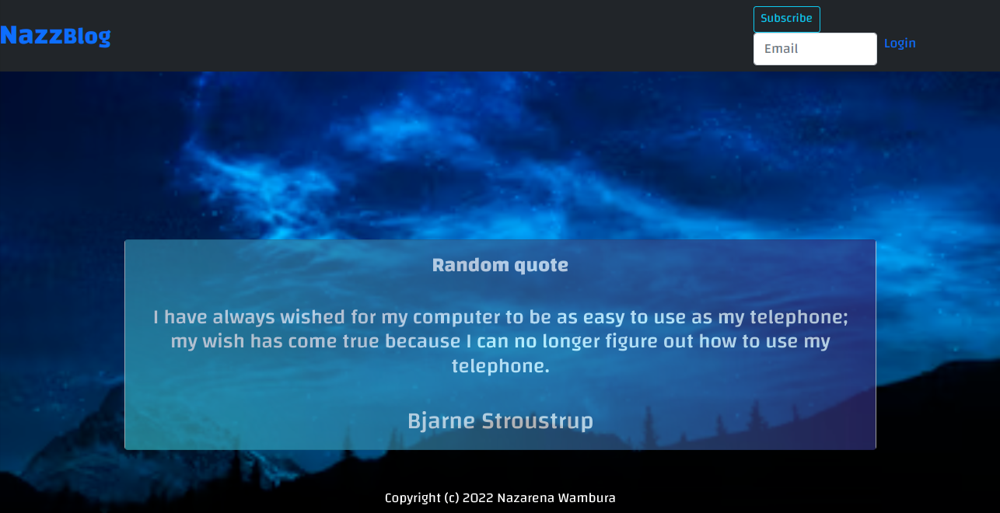
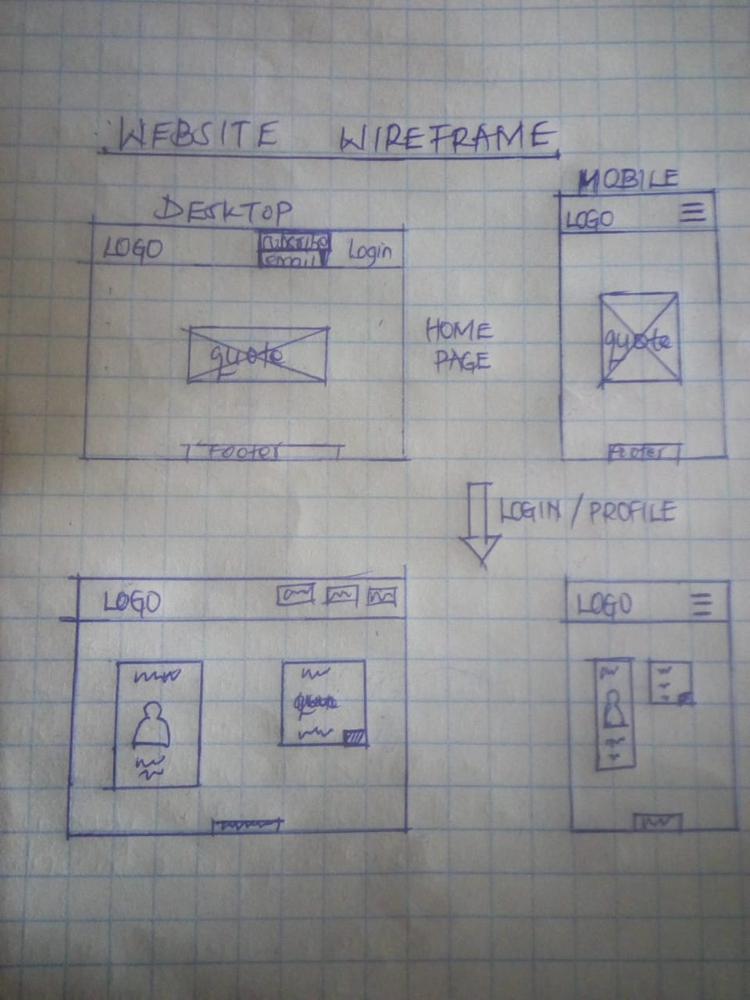

# blogPost

## homepage

## wireframe design

## Description
blogPost web application is built using Python framework (Flask). It allows users to create and share your opinions and other users can read and comment on them. It also displays random quotes to inspire your users.

## Author
Nazarena Wambura. 
[Github](https://github.com/nazarena254)

## Technologies used
* Python3.9
* Flask2.1.1
* Heroku7.60.2
* Markdown

## User stories.
  Users can:
- User sees random quotes on the site
- User can view the most recent posts
- User can subscribe to blog mailing list and receives an email alert when a new post is made.
- User can comment on blog posts.

  Writters can:
- sign in to the blog.
- create a blog from the application.
- delete comments that I find insulting or degrading
- update or delete blogs I have created.

## Behavior Driven Development

| Input                    | Behaviour                       | Output                                       |
| -------------------------| ------------------------------  | -------------------------------------------- |
| Subscribe to mail list              | Input the email               | Redirect you to the index page               |
| Writer login                    | Take you to home page           | Redirect you to the Homepage                 |
| Create a blog post by filling blog form          | Write your blog and post it to blogs    | Your blog is displayed  in index page                     | 
| User comment on the Blog post plus a nickname | Write your feedback and post it | Your feedback is displayed under the blog post   |
| Writer delete a blog post       | Deleting the blog post from the database    | The blog post will be deleted and not appear on the page                  |
| Writer update a blog post       | Updating the blog post in database    | The blog post will be updated                |
| Writer delete a comment         | Deleting the blog post in database    | The comment will no longer appear under the post                   |

 ## Installed packages
* Install code editor of your choice.
* Run `sudo apt-get update`,`sudo apt-get install python3.6` in terminal to install python.
* Install python extension in code editor(VScode) to run python modules easily.
* Run `python3.9 -m venv --without-pip virtual` in terminal to install virtual environment.
* Run `source virtual/bin/activate` to activate and `.../deactivate` to deactivate virtual env.
* Run `curl https://bootstrap.pypa.io/get-pip.py | python` to install pip in virtual env.
* Run `pip install <packagename>` to install other dependencies.
* Run `pip install flask` in terminal to install flask.
* Run `manage their personalities when working with a team.` to install postgresql its packages.
* Run `python3.9 manage.py server` to start server.
* Run `heroku run python3 manage.py db upgrade` to update heroku server. 
* To deploy on heroku, you will need to install/do the following:
   - outline dependencies `pip freeze`  
   - add dependencies in requirements.txt file `pip freeze > requirements.txt`
   - heroku cli `npm install -g heroku`
   - gunicorn  `python3.9 -m pip install gunicorn`
* To enable migrations:
   - Initialize migration `python3.9 manage.py db init`
   - Create migration `python3.9 manage.py db migrate -m "migration message"`  
   - Upgrade migration `python3.9 manage.py db upgrade` 

 

## Installation / Setup instruction
* Open Terminal {Ctrl+Alt+T}
* create and cd to the directory where you want to have your project
* git clone `https://github.com/nazarena254/blogPst.github.io.git` to have it locally.
* code . or atom . based on the text editor you have and work on it.

## License
Distributed under [MIT license](https://github.com/nazarena254/blogPost/blob/master/LICENSE). 
Copyright (c) 2022 Nazarena Wambura

## Support and Contact
Incase of another bug email me. 
Email:<nancyngunjiri1@gmail.com>
